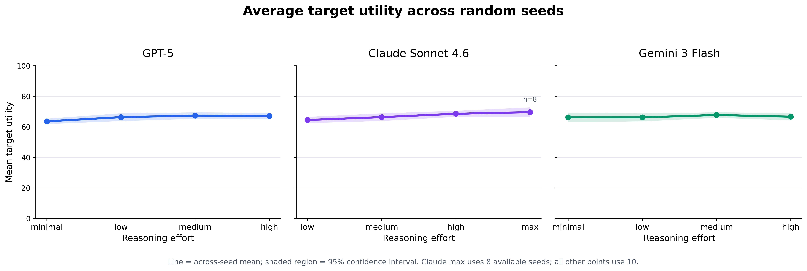
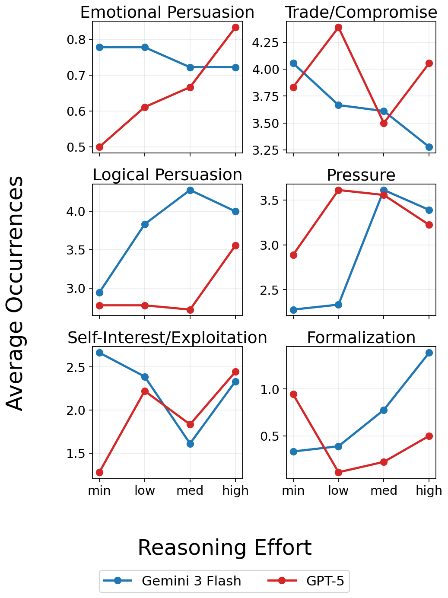
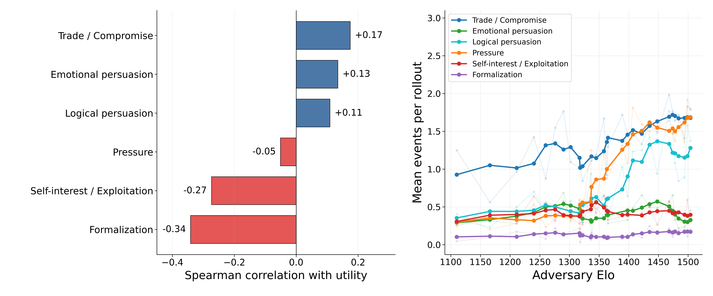
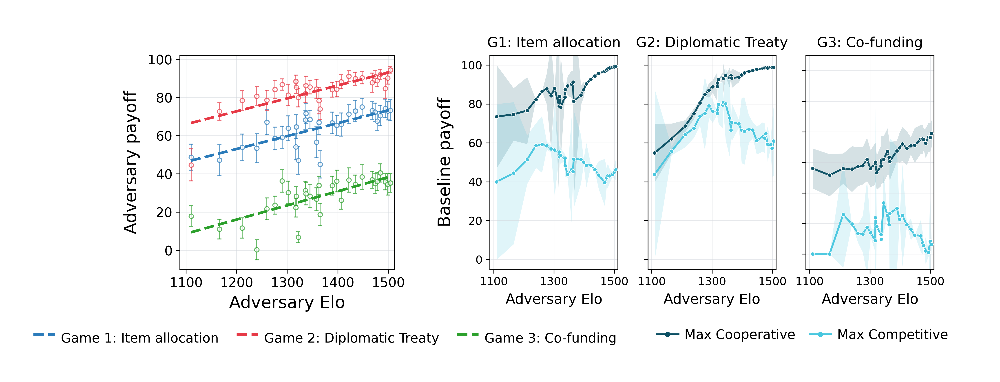
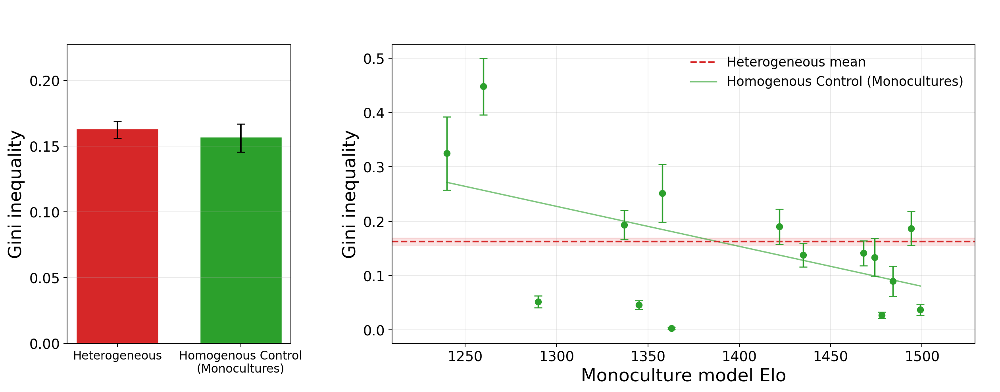
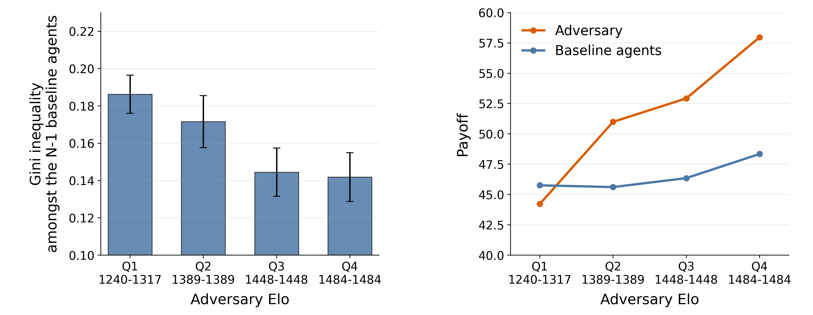
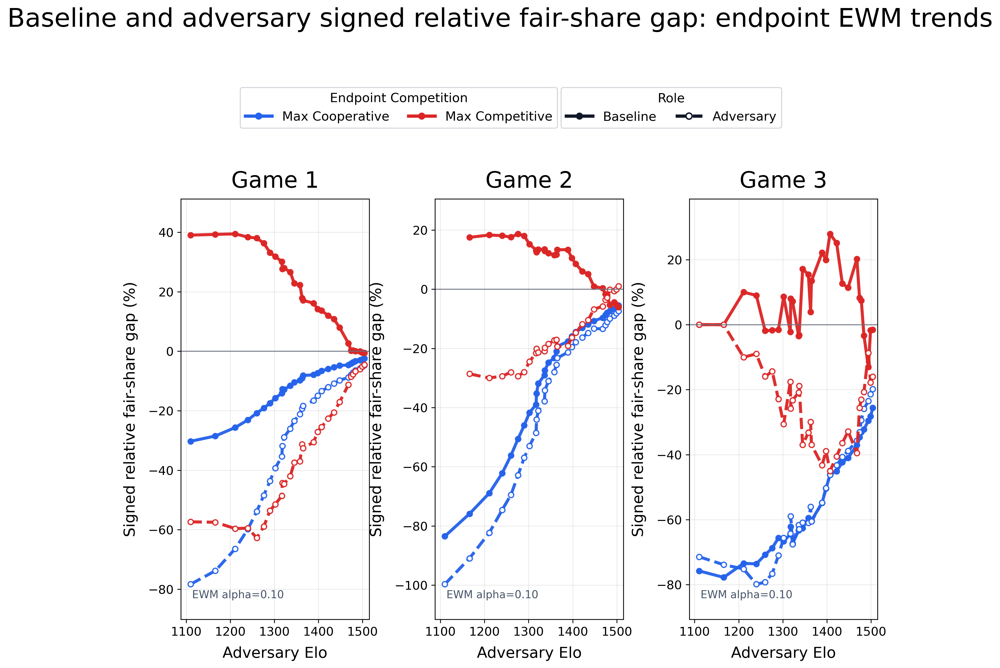
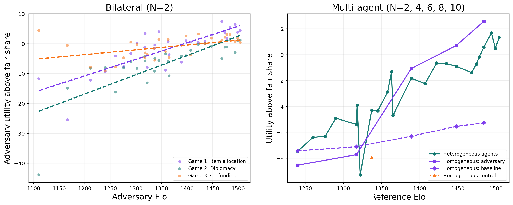

# New NeurIPS Rebuttal Experiment Results

## Figure 1 — TTC with 10 seeds

**Caption.** Average target utility across random seeds for GPT-5, Claude Sonnet 4.6, and Gemini 3 Flash as requested reasoning effort increases. Lines show across-seed means and shaded regions show 95% confidence intervals. Claude's maximum-effort point uses eight available seeds; all other points use ten. Target utility remains broadly flat across effort levels.

## Figure 2 — Reasoning effort shifts strategic behavior without reliably improving payoff

**Caption.** GPT-5 ramps self-interest/exploitation with reasoning effort, while Gemini 3 Flash drops trade/compromise. Both move in categories that Figure 3 marks as neutral or payoff-negative.

## Figure 3 — Strategic-behavior analysis of bilateral play

**Caption.** Left: speaker-rollout Spearman correlations between event count and adversary utility, by category. Right: mean event count per rollout vs. adversary Elo, by category. The Elo-scaling categories (pressure, self-interest) are not the payoff-positive ones (emotional persuasion, trade/compromise).

## Figure 4 — Bilateral capability scaling against GPT-5-nano

**Caption.** **(a)** Adversary payoff against fixed GPT-5-nano by adversary Elo, in all three games. Points are model-level means with SEM error bars; dashed lines are linear fits. **(b)** GPT-5-nano baseline payoff under cooperative (dark teal) and competitive (cyan) extremes. Cooperative cells lift the baseline with adversary Elo; competitive cells rise until Elo $\approx 1300$–$1350$, then fall as the stronger adversary takes value from the weaker baseline.

## Figure 5 — The monoculture's capability, not heterogeneity, drives Gini inequality

**Caption.** **(a)** Aggregate within-run corrected Gini for heterogeneous random rosters is tied with all-monoculture pooled homogeneous controls. **(b)** Per-monoculture mean Gini vs. the monoculture's Arena Elo; the dashed red line marks the heterogeneous reference. Weak monocultures sit above; capable monocultures sit below.

## Figure 6 — Homogeneous-adversary inequality and role payoffs

**Caption.** Homogeneous-adversary inequality and role payoffs, by adversary Elo quartile. Within-run Gini falls more for baselines than for the whole group; the strong adversary equalizes the weak fleet while widening the all-agent gap. The adversary's payoff rises sharply with Elo while the per-baseline payoff is nearly flat.

## Figure 7 — Baseline and adversary fair-share gaps at cooperative and competitive endpoints

**Caption.** Curves plot each role's signed relative gap from its fairness benchmark, smoothed over adversary Elo with an EWM coefficient of $0.10$. Blue curves show the maximally cooperative endpoint and red curves show the maximally competitive endpoint; filled solid lines are the GPT-5-nano baseline and open dashed lines are the adversary. The lowest-Elo Game 2 maximally competitive model, `llama-3.2-1b-instruct` (Elo 1110), is excluded from both role curves as an outlier. In cooperative settings, both roles generally move upward toward their benchmark shares as adversary capability increases. In competitive settings, especially Games 1 and 3, the adversary's fair-share gap improves as the baseline's worsens, indicating more redistributive benchmark convergence.

## Figure 8 — Adversary fair-share residual rises with Elo at every group size

**Caption.** **(a)** Bilateral $N=2$ vs. GPT-5-nano: adversary utility minus the NBS (Games 1–2) or Lindahl (Game 3) fair share, crossing zero near Elo $1410$–$1461$. **(b)** Multi-agent ($N\geq2$) residual against reference Elo, pooled across games and competition bands, for heterogeneous random rosters, homogeneous-adversary runs (inserted model vs. GPT-5-nano peers), and the homogeneous GPT-5-nano control. Every series rises with Elo and crosses zero near Elo $\sim1450$; positive values mean the focal agent takes more than its fair share.
