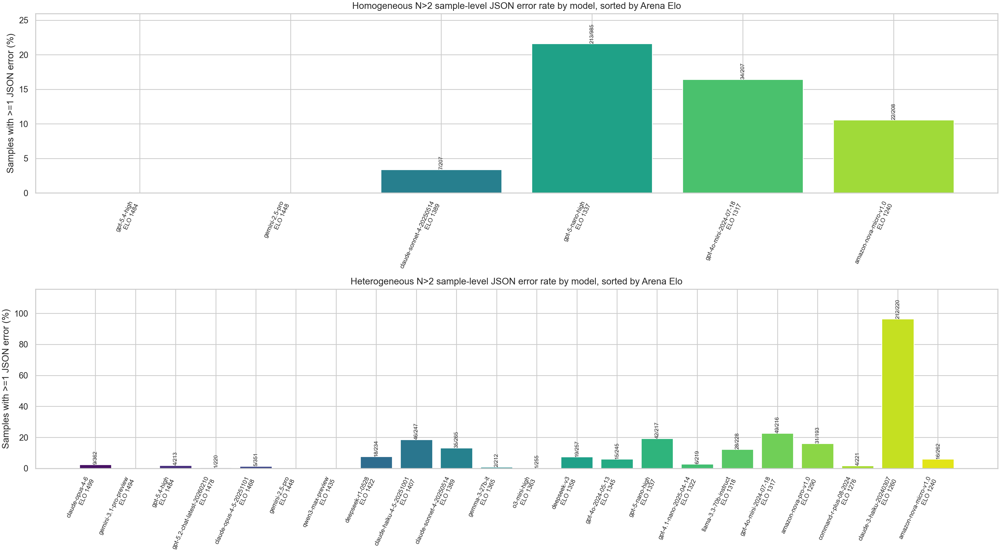
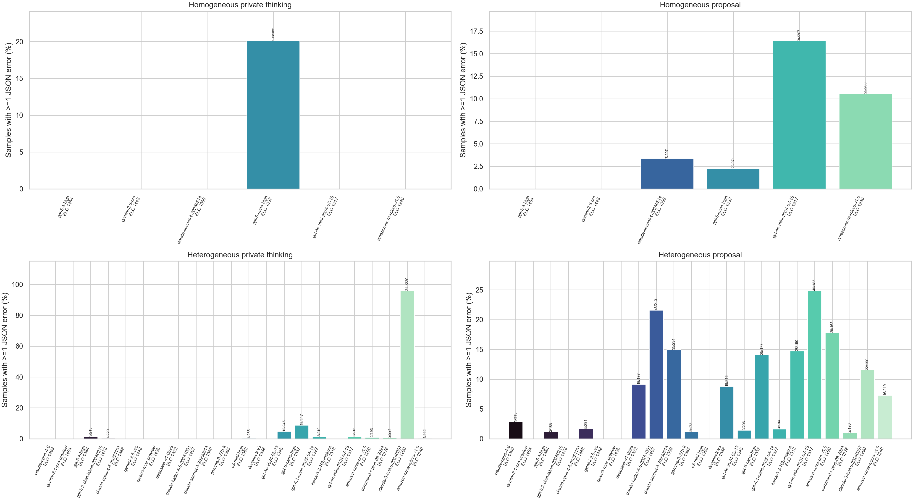
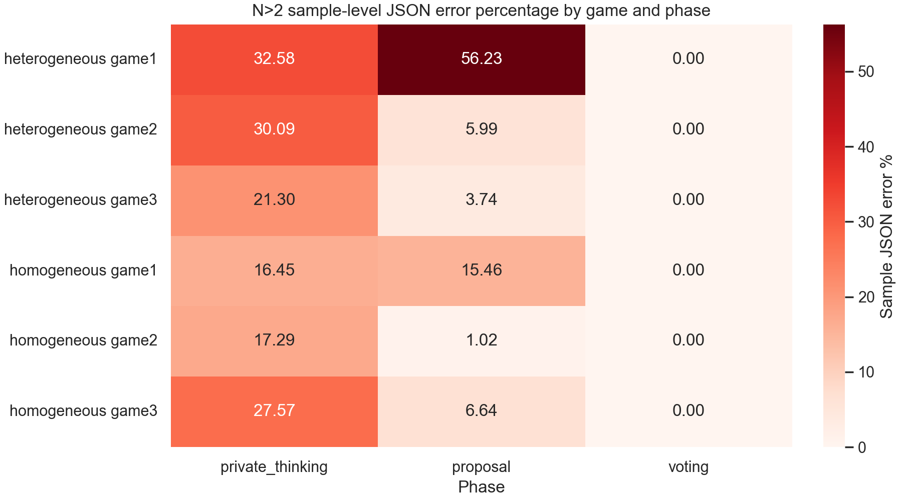
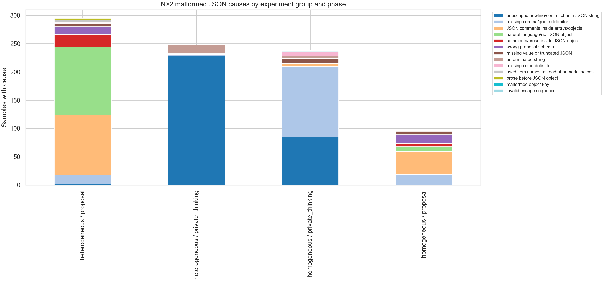
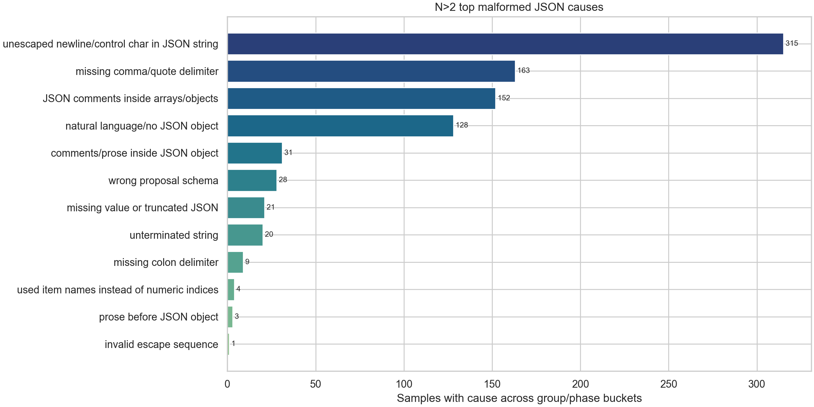
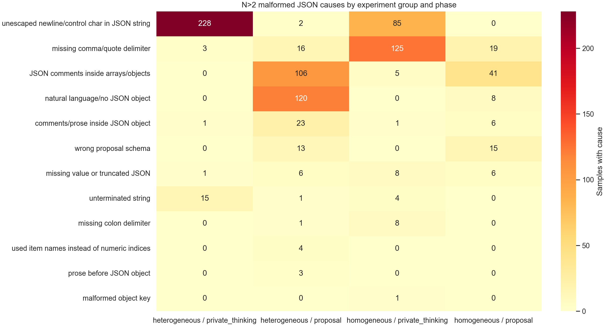
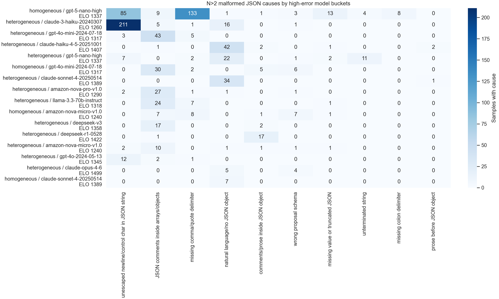
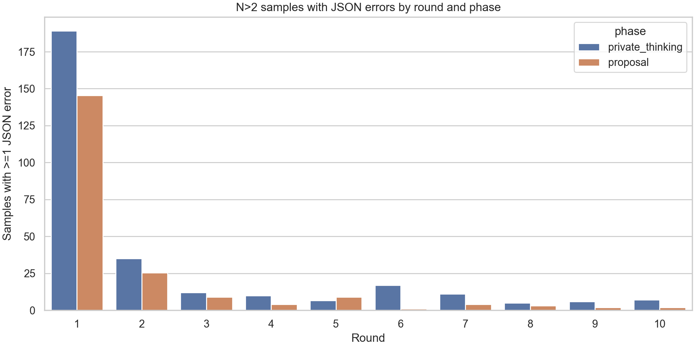

# JSON Parse Error Audit for Full Games 1/2/3

Generated: 2026-05-02

## Scope and Method

I analyzed these two result roots:

- Homogeneous: `experiments/results/full_games123_multiagent_production_20260428_085255/`
- Heterogeneous: `experiments/results/full_games123_multiagent_heterogeneous_equal_width_openrouter_repair_20260429_113848/`

The numerator is sample-level: a run/config sample counts once in a bucket if it has at least one JSON parse diagnostic in `monitoring/malformed_json_examples.json` for that bucket. The denominator is the number of run/config samples represented in `all_interactions.json` for the relevant bucket. For example, a model-phase denominator is the number of samples where that model made at least one call in that phase; the numerator is the number of those samples where that model had at least one JSON error in that phase.

The headline tables below use the requested `N > 2` subset. The raw folders also contain `N=2`; those are kept in `model_summary_all_N.csv` as a sensitivity check.

Arena Elo values are local, from `analysis/elo_variance_sampling_100k_context/filtered_100k_context_model_pool.csv`, plus the local `docs/guides/chatbot_arena_elo_scores_2026_03_31.md` entry for `gemini-3.1-pro-preview`.

## Headline Findings

- Across `N > 2`, homogeneous has **247/985** samples with at least one JSON error (25.08%). Heterogeneous has **403/823** (48.97%).
- This is **not only strong models failing at JSON**. The worst `N > 2` sample-level model rate is `claude-3-haiku-20240307` in `heterogeneous` runs: **212/220 = 96.36%**. Lower/mid models (`gpt-4o-mini`, `gpt-5-nano`, `claude-haiku-4-5`, `amazon-nova-*`, `llama-3.3-70b`) account for much of the high-rate mass.
- Strong models are mostly clean at the sample level. In `N > 2`, `gemini-3.1-pro-preview`, `gemini-2.5-pro`, and `qwen3-max-preview` have 0 samples with recorded JSON errors in this sample; `gpt-5.2-chat-latest`, `o3-mini-high`, `claude-opus-4-6`, and `gpt-5.4-high` are low relative to the worst buckets.
- The errors concentrate in **private thinking** and **proposal**. I found no recorded malformed JSON diagnostics in voting. The most concentrated game/phase bucket is heterogeneous Game 1 proposals.
- A large part is prompt/parser friction, not just model capability. The historical experiment prompts asked for JSON, but did **not** include the current repo's strict `JSON FORMAT REQUIREMENTS` block. Private thinking invited long free-form reasoning inside JSON string fields, and Game 1 proposals used large allocation objects without explicitly banning comments, markdown fences, prose, placeholders, or literal line breaks inside string values. **691/1131 (61.10%)** of `N > 2` malformed raw responses are syntactically parseable by the current deterministic JSON repair helper, so many failures are recoverable syntax issues.

## Main Plots

## By Model

Top `N > 2` model-level JSON error rates, where each model/sample pair counts once:

| experiment_group   | model_normalized             |   arena_elo |   samples_with_json_error |   samples |   sample_json_error_pct |
|:-------------------|:-----------------------------|------------:|--------------------------:|----------:|------------------------:|
| heterogeneous      | claude-3-haiku-20240307      |        1260 |                       212 |       220 |               96.3636   |
| heterogeneous      | gpt-4o-mini-2024-07-18       |        1317 |                        49 |       216 |               22.6852   |
| homogeneous        | gpt-5-nano-high              |        1337 |                       213 |       985 |               21.6244   |
| heterogeneous      | gpt-5-nano-high              |        1337 |                        42 |       217 |               19.3548   |
| heterogeneous      | claude-haiku-4-5-20251001    |        1407 |                        46 |       247 |               18.6235   |
| homogeneous        | gpt-4o-mini-2024-07-18       |        1317 |                        34 |       207 |               16.4251   |
| heterogeneous      | amazon-nova-pro-v1.0         |        1290 |                        31 |       193 |               16.0622   |
| heterogeneous      | claude-sonnet-4-20250514     |        1389 |                        35 |       265 |               13.2075   |
| heterogeneous      | llama-3.3-70b-instruct       |        1318 |                        28 |       228 |               12.2807   |
| homogeneous        | amazon-nova-micro-v1.0       |        1240 |                        22 |       208 |               10.5769   |
| heterogeneous      | deepseek-r1-0528             |        1422 |                        18 |       234 |                7.69231  |
| heterogeneous      | deepseek-v3                  |        1358 |                        19 |       257 |                7.393    |
| heterogeneous      | gpt-4o-2024-05-13            |        1345 |                        15 |       245 |                6.12245  |
| heterogeneous      | amazon-nova-micro-v1.0       |        1240 |                        16 |       262 |                6.10687  |
| homogeneous        | claude-sonnet-4-20250514     |        1389 |                         7 |       207 |                3.38164  |
| heterogeneous      | gpt-4.1-nano-2025-04-14      |        1322 |                         6 |       219 |                2.73973  |
| heterogeneous      | claude-opus-4-6              |        1499 |                         9 |       362 |                2.48619  |
| heterogeneous      | gpt-5.4-high                 |        1484 |                         4 |       213 |                1.87793  |
| heterogeneous      | command-r-plus-08-2024       |        1276 |                         4 |       221 |                1.80995  |
| heterogeneous      | claude-opus-4-5-20251101     |        1468 |                         5 |       351 |                1.4245   |
| heterogeneous      | gemma-3-27b-it               |        1365 |                         2 |       212 |                0.943396 |
| heterogeneous      | gpt-5.2-chat-latest-20260210 |        1478 |                         1 |       220 |                0.454545 |
| heterogeneous      | o3-mini-high                 |        1363 |                         1 |       255 |                0.392157 |
| heterogeneous      | gemini-2.5-pro               |        1448 |                         0 |       223 |                0        |
| heterogeneous      | gemini-3.1-pro-preview       |        1494 |                         0 |       228 |                0        |
| heterogeneous      | qwen3-max-preview            |        1435 |                         0 |       230 |                0        |
| homogeneous        | gemini-2.5-pro               |        1448 |                         0 |       208 |                0        |
| homogeneous        | gpt-5.4-high                 |        1484 |                         0 |        51 |                0        |

## By Phase

`N > 2` phase-level rates:

| experiment_group   | phase            |   samples_with_json_error |   samples |   sample_json_error_pct |
|:-------------------|:-----------------|--------------------------:|----------:|------------------------:|
| heterogeneous      | private_thinking |                       248 |       823 |                30.1337  |
| heterogeneous      | proposal         |                       244 |       817 |                29.8654  |
| heterogeneous      | voting           |                         0 |       627 |                 0       |
| homogeneous        | private_thinking |                       198 |       985 |                20.1015  |
| homogeneous        | proposal         |                        83 |       984 |                 8.43496 |
| homogeneous        | voting           |                         0 |       949 |                 0       |

Top model-phase cells:

| experiment_group   | model_normalized          |   arena_elo | phase            |   samples_with_json_error |   samples |   sample_json_error_pct |
|:-------------------|:--------------------------|------------:|:-----------------|--------------------------:|----------:|------------------------:|
| heterogeneous      | claude-3-haiku-20240307   |        1260 | private_thinking |                       211 |       220 |               95.9091   |
| heterogeneous      | gpt-4o-mini-2024-07-18    |        1317 | proposal         |                        46 |       185 |               24.8649   |
| heterogeneous      | claude-haiku-4-5-20251001 |        1407 | proposal         |                        46 |       213 |               21.5962   |
| homogeneous        | gpt-5-nano-high           |        1337 | private_thinking |                       198 |       985 |               20.1015   |
| heterogeneous      | amazon-nova-pro-v1.0      |        1290 | proposal         |                        29 |       163 |               17.7914   |
| homogeneous        | gpt-4o-mini-2024-07-18    |        1317 | proposal         |                        34 |       207 |               16.4251   |
| heterogeneous      | claude-sonnet-4-20250514  |        1389 | proposal         |                        35 |       234 |               14.9573   |
| heterogeneous      | llama-3.3-70b-instruct    |        1318 | proposal         |                        28 |       190 |               14.7368   |
| heterogeneous      | gpt-5-nano-high           |        1337 | proposal         |                        25 |       177 |               14.1243   |
| heterogeneous      | claude-3-haiku-20240307   |        1260 | proposal         |                        22 |       190 |               11.5789   |
| homogeneous        | amazon-nova-micro-v1.0    |        1240 | proposal         |                        22 |       208 |               10.5769   |
| heterogeneous      | deepseek-r1-0528          |        1422 | proposal         |                        18 |       197 |                9.13706  |
| heterogeneous      | deepseek-v3               |        1358 | proposal         |                        19 |       216 |                8.7963   |
| heterogeneous      | gpt-5-nano-high           |        1337 | private_thinking |                        19 |       217 |                8.75576  |
| heterogeneous      | amazon-nova-micro-v1.0    |        1240 | proposal         |                        16 |       219 |                7.30594  |
| heterogeneous      | gpt-4o-2024-05-13         |        1345 | private_thinking |                        12 |       245 |                4.89796  |
| homogeneous        | claude-sonnet-4-20250514  |        1389 | proposal         |                         7 |       207 |                3.38164  |
| heterogeneous      | claude-opus-4-6           |        1499 | proposal         |                         9 |       315 |                2.85714  |
| homogeneous        | gpt-5-nano-high           |        1337 | proposal         |                        22 |       971 |                2.26571  |
| heterogeneous      | claude-opus-4-5-20251101  |        1468 | proposal         |                         5 |       291 |                1.71821  |
| heterogeneous      | gpt-4.1-nano-2025-04-14   |        1322 | proposal         |                         3 |       184 |                1.63043  |
| heterogeneous      | gpt-4o-2024-05-13         |        1345 | proposal         |                         3 |       206 |                1.45631  |
| heterogeneous      | gpt-5.4-high              |        1484 | private_thinking |                         3 |       213 |                1.40845  |
| heterogeneous      | gpt-4o-mini-2024-07-18    |        1317 | private_thinking |                         3 |       216 |                1.38889  |
| heterogeneous      | gpt-4.1-nano-2025-04-14   |        1322 | private_thinking |                         3 |       219 |                1.36986  |
| heterogeneous      | gpt-5.4-high              |        1484 | proposal         |                         2 |       168 |                1.19048  |
| heterogeneous      | gemma-3-27b-it            |        1365 | proposal         |                         2 |       173 |                1.15607  |
| heterogeneous      | command-r-plus-08-2024    |        1276 | proposal         |                         2 |       190 |                1.05263  |
| heterogeneous      | amazon-nova-pro-v1.0      |        1290 | private_thinking |                         2 |       193 |                1.03627  |
| heterogeneous      | command-r-plus-08-2024    |        1276 | private_thinking |                         2 |       221 |                0.904977 |

## By Game

`N > 2` game/phase rates:

| experiment_group   | game   | phase            |   samples_with_json_error |   samples |   sample_json_error_pct |
|:-------------------|:-------|:-----------------|--------------------------:|----------:|------------------------:|
| heterogeneous      | game1  | private_thinking |                       129 |       396 |                32.5758  |
| heterogeneous      | game1  | proposal         |                       221 |       393 |                56.2341  |
| heterogeneous      | game1  | voting           |                         0 |       218 |                 0       |
| heterogeneous      | game2  | private_thinking |                        96 |       319 |                30.094   |
| heterogeneous      | game2  | proposal         |                        19 |       317 |                 5.99369 |
| heterogeneous      | game2  | voting           |                         0 |       308 |                 0       |
| heterogeneous      | game3  | private_thinking |                        23 |       108 |                21.2963  |
| heterogeneous      | game3  | proposal         |                         4 |       107 |                 3.73832 |
| heterogeneous      | game3  | voting           |                         0 |       101 |                 0       |
| homogeneous        | game1  | private_thinking |                        64 |       389 |                16.4524  |
| homogeneous        | game1  | proposal         |                        60 |       388 |                15.4639  |
| homogeneous        | game1  | voting           |                         0 |       354 |                 0       |
| homogeneous        | game2  | private_thinking |                        51 |       295 |                17.2881  |
| homogeneous        | game2  | proposal         |                         3 |       295 |                 1.01695 |
| homogeneous        | game2  | voting           |                         0 |       294 |                 0       |
| homogeneous        | game3  | private_thinking |                        83 |       301 |                27.5748  |
| homogeneous        | game3  | proposal         |                        20 |       301 |                 6.64452 |
| homogeneous        | game3  | voting           |                         0 |       301 |                 0       |

Interpretation:

- Game 1 item allocation is the proposal hot spot. In high-N settings, the proposal object is large and models often annotate arrays with comments such as `// Ring` or return a discussion-style counterproposal instead of the required `allocation` object.
- Game 2 and Game 3 mostly fail in private thinking, where the model tries to produce the requested JSON but puts multi-paragraph text into string values with literal newlines or misses a comma between fields.
- Game 3 proposal errors are relatively rare; the co-funding vector schema is simpler than a full item allocation over many agents/items.

## Error Causes

Top `N > 2` causes, counted once per sample/cause across the two experiment groups. A sample can have more than one cause, so percentages need not sum to 100%.

| error_cause                                   |   samples_with_cause |   pct_of_error_samples |
|:----------------------------------------------|---------------------:|-----------------------:|
| unescaped newline/control char in JSON string |                  313 |              48.1538   |
| missing comma/quote delimiter                 |                  154 |              23.6923   |
| JSON comments inside arrays/objects           |                  151 |              23.2308   |
| natural language/no JSON object               |                  128 |              19.6923   |
| comments/prose inside JSON object             |                   31 |               4.76923  |
| wrong proposal schema                         |                   28 |               4.30769  |
| missing value or truncated JSON               |                   21 |               3.23077  |
| unterminated string                           |                   20 |               3.07692  |
| missing colon delimiter                       |                    9 |               1.38462  |
| used item names instead of numeric indices    |                    4 |               0.615385 |
| prose before JSON object                      |                    3 |               0.461538 |
| malformed object key                          |                    1 |               0.153846 |
| invalid escape sequence                       |                    1 |               0.153846 |

`N > 2` sample-cause counts. A sample can contribute to multiple causes if it has multiple kinds of JSON error, but it is counted at most once per cause/phase:

| experiment_group   | phase            | error_cause                                   |   samples_with_json_error |
|:-------------------|:-----------------|:----------------------------------------------|--------------------------:|
| heterogeneous      | private_thinking | unescaped newline/control char in JSON string |                       228 |
| homogeneous        | private_thinking | missing comma/quote delimiter                 |                       125 |
| heterogeneous      | proposal         | natural language/no JSON object               |                       120 |
| heterogeneous      | proposal         | JSON comments inside arrays/objects           |                       106 |
| homogeneous        | private_thinking | unescaped newline/control char in JSON string |                        85 |
| homogeneous        | proposal         | JSON comments inside arrays/objects           |                        41 |
| heterogeneous      | proposal         | comments/prose inside JSON object             |                        23 |
| homogeneous        | proposal         | missing comma/quote delimiter                 |                        19 |
| heterogeneous      | proposal         | missing comma/quote delimiter                 |                        16 |
| heterogeneous      | private_thinking | unterminated string                           |                        15 |
| homogeneous        | proposal         | wrong proposal schema                         |                        15 |
| heterogeneous      | proposal         | wrong proposal schema                         |                        13 |
| homogeneous        | private_thinking | missing colon delimiter                       |                         8 |
| homogeneous        | private_thinking | missing value or truncated JSON               |                         8 |
| homogeneous        | proposal         | natural language/no JSON object               |                         8 |
| heterogeneous      | proposal         | missing value or truncated JSON               |                         6 |
| homogeneous        | proposal         | comments/prose inside JSON object             |                         6 |
| homogeneous        | proposal         | missing value or truncated JSON               |                         6 |
| homogeneous        | private_thinking | JSON comments inside arrays/objects           |                         5 |
| homogeneous        | private_thinking | unterminated string                           |                         4 |
| heterogeneous      | proposal         | used item names instead of numeric indices    |                         4 |
| heterogeneous      | proposal         | prose before JSON object                      |                         3 |
| heterogeneous      | private_thinking | missing comma/quote delimiter                 |                         3 |
| heterogeneous      | proposal         | unescaped newline/control char in JSON string |                         2 |
| heterogeneous      | proposal         | missing colon delimiter                       |                         1 |
| heterogeneous      | private_thinking | missing value or truncated JSON               |                         1 |
| heterogeneous      | private_thinking | comments/prose inside JSON object             |                         1 |
| heterogeneous      | proposal         | unterminated string                           |                         1 |
| homogeneous        | private_thinking | malformed object key                          |                         1 |
| homogeneous        | private_thinking | comments/prose inside JSON object             |                         1 |
| homogeneous        | private_thinking | invalid escape sequence                       |                         1 |

The dominant raw failure patterns are:

- **Unescaped newlines/control characters inside JSON strings.** This is especially common in private thinking. The model starts with a JSON object, then writes multi-paragraph `reasoning` or `strategy` values with literal newlines.
- **JSON comments inside arrays/objects.** This is especially common in Game 1 proposals. Models write valid-looking allocation arrays but annotate entries with `// Apple`, `# Stone`, etc., which is not JSON.
- **Natural-language/no JSON object.** Some proposal repair attempts drift into discussion text, e.g. `[Round 1 | Discussion] ...`, or markdown analysis instead of a JSON proposal.
- **Wrong proposal schema.** A smaller set returns an `agreement` array in Game 1 or omits the `allocation` object, so this is not pure JSON syntax failure; it is schema confusion.

## Cause-by-Cause Prompt Assessment

| error_cause                                   |   samples_with_cause | plain_cause                                                       | prompt_assessment                                                                                                                                                                           | suggestion                                                                                                                             |
|:----------------------------------------------|---------------------:|:------------------------------------------------------------------|:--------------------------------------------------------------------------------------------------------------------------------------------------------------------------------------------|:---------------------------------------------------------------------------------------------------------------------------------------|
| unescaped newline/control char in JSON string |                  313 | literal line breaks inside quoted strings                         | Historical prompt was incomplete: it asked for JSON, but did not explicitly ban literal line breaks inside string values. Current repo has a shared strict-format block that does ban this. | Keep reasoning/strategy as one-line strings, cap their length, or change private thinking to arrays of short strings parsed as arrays. |
| missing comma/quote delimiter                 |                  154 | invalid punctuation between fields or after long strings          | Prompt allowed long free-form reasoning strings, which increases delimiter mistakes. It did not require concise one-line fields.                                                            | Shorten text fields, prefer arrays of short strings, and keep examples compact without long prose.                                     |
| JSON comments inside arrays/objects           |                  151 | extraneous JSON comments such as // Apple beside array values     | Historical proposal prompt said use item indices, but did not explicitly ban comments or labels inside arrays. This was under-specified for weaker models.                                  | State that allocation arrays may contain only bare integers, with no item names, labels, comments, parentheses notes, or placeholders. |
| natural language/no JSON object               |                  128 | model answered with discussion or analysis instead of JSON        | Proposal/vote prompts said ONLY JSON, but private thinking only said 'Respond with a JSON object'. No provider-enforced JSON mode was used.                                                 | Use provider JSON/schema mode when available and add a same-call repair retry that includes the invalid response and exact schema.     |
| comments/prose inside JSON object             |                   31 | comments or prose placed between JSON fields                      | Historical prompt did not explicitly ban prose before/after or inside the JSON object. Current repo's shared block does.                                                                    | Retain the strict block in every structured prompt and repeat it in repair prompts.                                                    |
| wrong proposal schema                         |                   28 | valid-ish JSON with the wrong top-level schema                    | Prompt showed the target schema, but Game 1/Game 2 schemas are similar enough that some models used agreement vectors in item allocation.                                                   | Name the game/schema in the final instruction and add negative examples: Game 1 must use allocation, never agreement.                  |
| missing value or truncated JSON               |                   21 | partial JSON, placeholders, or invalid values such as '(no item)' | Prompt did not explicitly ban placeholders inside arrays. Some cases may also be output truncation.                                                                                         | Ban placeholders, compact examples, and keep max output sufficient for N=10 item allocations.                                          |
| unterminated string                           |                   20 | long string started but not closed                                | Long private-thinking fields made this more likely. Prompt did not cap field length.                                                                                                        | Cap reasoning/strategy fields or convert them to short bullet arrays.                                                                  |
| missing colon delimiter                       |                    9 | field key was not followed by ':'                                 | Usually a generic syntax miss in long JSON outputs rather than a specific missing instruction.                                                                                              | Use compact examples and provider JSON/schema mode.                                                                                    |
| used item names instead of numeric indices    |                    4 | item names returned where integer indices were required           | Prompt did specify indices, so this is mostly model compliance/schema confusion rather than missing prompt text.                                                                            | Repeat that arrays contain integers only and validate/repair item names deterministically when unambiguous.                            |
| prose before JSON object                      |                    3 | introductory text before the object                               | Historical private-thinking prompt did not say ONLY JSON; proposal/vote did, but without enforced schema.                                                                                   | Say 'first character must be { and last character must be }' in structured phases.                                                     |
| malformed object key                          |                    1 | invalid or unquoted object key                                    | Prompt example used valid keys, but did not explicitly say double quotes are mandatory.                                                                                                     | Add 'double quotes only for all keys and strings' to strict JSON requirements.                                                         |

## Historical Prompt Audit

I checked the actual prompts stored in `all_interactions.json` for the two experiment folders. The historical runs did not include the current repo's shared strict-format block in any structured phase: no prompt contained `JSON FORMAT REQUIREMENTS`, no prompt explicitly banned JSON comments, and no prompt explicitly banned literal line breaks inside quoted string values.

`N > 2` structured-call prompt flags:

| experiment_group   | phase            |   structured_calls |   samples |   prompt_says_only_json_pct |   prompt_has_strict_json_requirements_pct |   prompt_bans_json_comments_pct |   prompt_bans_literal_newlines_in_strings_pct |   prompt_bans_markdown_fences_pct |
|:-------------------|:-----------------|-------------------:|----------:|----------------------------:|------------------------------------------:|--------------------------------:|----------------------------------------------:|----------------------------------:|
| heterogeneous      | private_thinking |               7105 |       823 |                      0      |                                         0 |                               0 |                                             0 |                                 0 |
| heterogeneous      | proposal         |               8089 |       817 |                     97.1937 |                                         0 |                               0 |                                             0 |                                 0 |
| heterogeneous      | voting           |              29420 |       627 |                    100      |                                         0 |                               0 |                                             0 |                                 0 |
| homogeneous        | private_thinking |              12671 |       985 |                      0      |                                         0 |                               0 |                                             0 |                                 0 |
| homogeneous        | proposal         |              13007 |       984 |                    100      |                                         0 |                               0 |                                             0 |                                 0 |
| homogeneous        | voting           |              52311 |       949 |                    100      |                                         0 |                               0 |                                             0 |                                 0 |

## Specific Conversations

Highest-error `N > 2` runs. This table intentionally keeps event counts so the report can identify specific conversations to inspect:

| experiment_group   |   config_id | run_name                                                                                           | game   |   n_agents |   json_errors |
|:-------------------|------------:|:---------------------------------------------------------------------------------------------------|:-------|-----------:|--------------:|
| homogeneous        |         889 | config_0889_game1_homogeneous_adversary_n10_comp_0p25_gpt_4o_mini_2024_07_18_first_seed1           | game1  |         10 |             9 |
| homogeneous        |        2607 | config_2607_game3_homogeneous_adversary_n10_sigma_0p2_alpha_0p8_amazon_nova_micro_v1p0_first_seed1 | game3  |         10 |             9 |
| homogeneous        |        2649 | config_2649_game3_homogeneous_adversary_n10_sigma_0p5_alpha_0p2_amazon_nova_micro_v1p0_first_seed1 | game3  |         10 |             9 |
| heterogeneous      |         865 | config_0865_game1_heterogeneous_random_n10_comp_0p0_run03                                          | game1  |         10 |             8 |
| heterogeneous      |         586 | config_0586_game1_heterogeneous_random_n6_comp_0p75_run18                                          | game1  |          6 |             7 |
| homogeneous        |         849 | config_0849_game1_homogeneous_adversary_n10_comp_0p0_gpt_4o_mini_2024_07_18_last_seed1             | game1  |         10 |             7 |
| homogeneous        |        2452 | config_2452_game3_homogeneous_adversary_n8_sigma_0p2_alpha_0p8_gemini_2p5_pro_first_seed2          | game3  |          8 |             7 |
| homogeneous        |        2613 | config_2613_game3_homogeneous_adversary_n10_sigma_0p2_alpha_0p8_gpt_4o_mini_2024_07_18_last_seed1  | game3  |         10 |             7 |
| heterogeneous      |         624 | config_0624_game1_heterogeneous_random_n6_comp_1p0_run14                                           | game1  |          6 |             6 |
| homogeneous        |        1015 | config_1015_game1_homogeneous_adversary_n10_comp_1p0_gpt_4o_mini_2024_07_18_first_seed1            | game1  |         10 |             6 |

Two representative conversations:

- `config_0865_game1_heterogeneous_random_n10_comp_0p0_run03` has 8 JSON errors. They are not from one model: `gpt-4o-mini`, `claude-sonnet-4`, `llama-3.3-70b`, `gpt-5-nano`, and `gpt-4o` all appear. The errors are mostly Round 1 proposal attempts in Game 1: comments in allocation arrays, markdown/prose instead of JSON, and one later private-thinking multiline-string failure.
- `config_2649_game3_homogeneous_adversary_n10_sigma_0p5_alpha_0p2_amazon_nova_micro_v1p0_first_seed1` has 9 JSON errors. Most are `gpt-5-nano` private-thinking failures in later co-funding rounds, caused by missing commas or unescaped multiline reasoning. One `amazon-nova-micro` proposal misses a comma between `contributions` and `reasoning`.

So the errors are not confined to one conversation, but the failure mode is phase-specific: Game 1 proposal generation at high N and private-thinking JSON across games.

## Prompt Assessment

For these historical experiments, the prompt/specification was only partially correct.

- Proposal and voting prompts were directionally correct because they usually said `Respond with ONLY a JSON object in this exact format` and gave an example.
- Private-thinking prompts were weaker: they said `Respond with a JSON object`, not `ONLY`, and then asked for long strategic analysis fields.
- The historical structured prompts did not systematically ban comments, markdown fences, `#`/`//` annotations, placeholders inside arrays, single quotes, or literal newlines inside string values. A small subset of proposal repair prompts banned prose outside JSON, but the original phase prompts did not carry a complete strict-format contract.
- The current worktree already contains a shared `GameEnvironment.json_format_requirements()` block and deterministic JSON repair helpers. Future runs need to be generated from that prompt version or stricter.

Recommended fixes:

1. Use provider structured outputs / JSON schema where available for private thinking, proposals, and votes. Prompting alone will not fully eliminate these errors for weak models.
2. Keep the current shared strict-format block in every structured prompt and repair prompt.
3. Add an item-allocation-specific ban: allocation arrays must contain only bare integers, never item names, comments, labels, `(no item)`, or parenthetical notes.
4. Shorten private-thinking fields: one-sentence `reasoning` and `strategy`, or change the schema to arrays of short strings and update normalization accordingly.
5. Use compact JSON examples for large Game 1 allocations. Pretty-printed arrays invite models to annotate each line with comments.
6. Keep deterministic repair enabled, because most failures are syntax-adjacent and recoverable, but continue reporting schema failures separately from syntax failures.

## Proposed Diff

I wrote a proposed future-run hardening patch here:

- `analysis/json_parse_errors_20260502/proposed_json_prompt_hardening.diff`

The diff is intentionally prompt-focused. It does not change game payoffs or negotiation mechanics; it tightens the system instruction, shared JSON requirements, Game 1 array rules, private-thinking wording, and repair prompts.

## Output Files

- Classified malformed examples: `analysis/json_parse_errors_20260502/malformed_examples_classified.csv`
- Model summary, all N: `analysis/json_parse_errors_20260502/model_summary_all_N.csv`
- Model summary, N>2: `analysis/json_parse_errors_20260502/model_summary_N_gt_2.csv`
- Model-phase summary, N>2: `analysis/json_parse_errors_20260502/model_phase_summary_N_gt_2.csv`
- Game-phase summary, N>2: `analysis/json_parse_errors_20260502/game_phase_summary_N_gt_2.csv`
- Cause summary, N>2: `analysis/json_parse_errors_20260502/cause_summary_N_gt_2.csv`
- Cause-model summary, N>2: `analysis/json_parse_errors_20260502/cause_model_summary_N_gt_2.csv`
- Cause-game-phase summary, N>2: `analysis/json_parse_errors_20260502/cause_game_phase_summary_N_gt_2.csv`
- Prompt requirements summary, N>2: `analysis/json_parse_errors_20260502/prompt_requirements_summary_N_gt_2.csv`
- Proposed prompt hardening diff: `analysis/json_parse_errors_20260502/proposed_json_prompt_hardening.diff`
