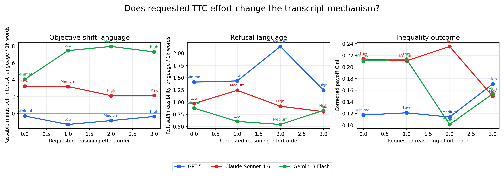
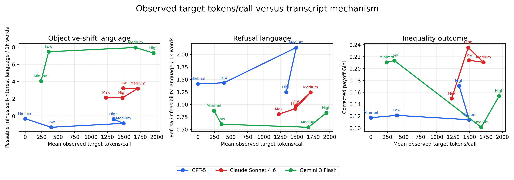
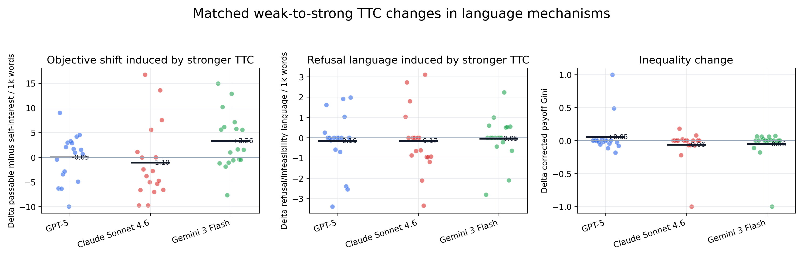
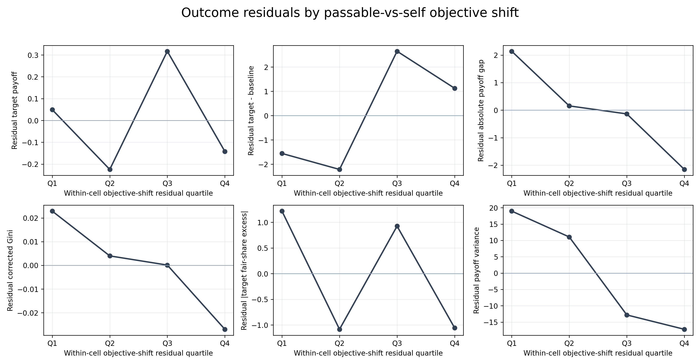
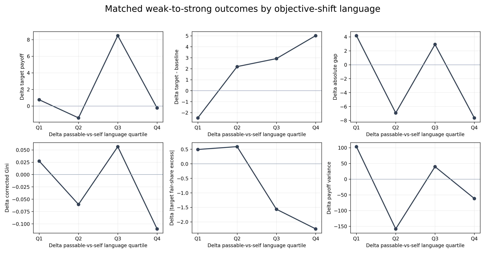
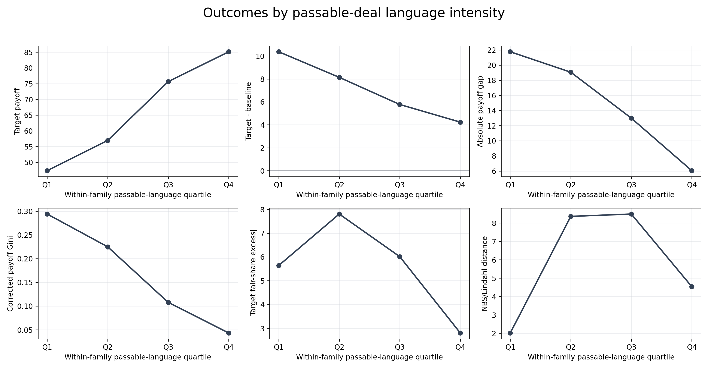
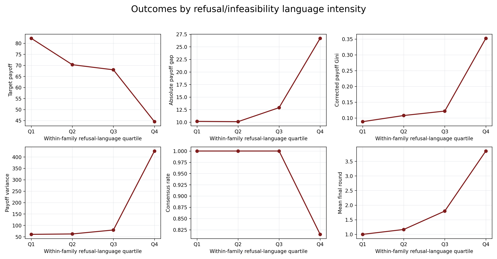

# TTC Plot Explanations For Fresh Eyes

This file explains the four mechanism plots from the TTC analysis as if the reader has not seen the earlier report.

The central question is:

> When models use more test-time compute, do they become better bargainers, fairer bargainers, or just different kinds of bargainers?

The raw payoff plots did not show a clean "more compute means more target payoff" trend. These four plots are an attempt to understand why. They do not just ask whether tokens predict payoff. They ask whether the *kind of reasoning in the transcript* is associated with different bargaining outcomes.

## The One-Sentence Mental Model

There are two different things deliberation can do:

1. It can make the agent search for a passable deal: "What agreement can actually work, pass, and avoid delay?"
2. It can make the agent discover a dead end: "This deal is infeasible, unfair to me, or gives me negative utility, so I should refuse."

The first mode tends to make outcomes more equal. The second mode tends to make outcomes worse, later, and less likely to reach agreement. That is why TTC does not simply improve payoff.

## Shared Vocabulary

**Target agent**  
The model condition being varied in the TTC experiment. This is the model whose reasoning effort changes.

**Baseline agent**  
The fixed opponent, usually `gpt-5-nano` with low reasoning.

**Target payoff**  
The final utility received by the target agent. Higher means the target did better for itself.

**Target - baseline**  
The target's payoff minus the baseline's payoff.

- Positive means the target did better than the baseline.
- Negative means the baseline did better than the target.
- This is a signed advantage measure, not a pure fairness measure.

**Absolute payoff gap**  
The size of the payoff difference between target and baseline, ignoring who won.

- Lower means the two agents ended closer together.
- This is usually a better fairness/equality measure than `target - baseline`.

**Corrected payoff Gini**  
An inequality score over the agents' payoffs, with the correction needed for the two-agent setting.

- Lower means more equal.
- Higher means more unequal.

**Payoff variance**  
Another measure of payoff spread.

- Lower means payoffs are clustered together.
- Higher means payoffs are far apart.

**NBS/Lindahl distance**  
Distance from the fairness benchmark used for these games.

- NBS is the Nash bargaining solution-style benchmark for Games 1 and 2.
- Lindahl-style fairness is the benchmark for Game 3.
- Lower means closer to the benchmark.
- Higher means farther from the benchmark.

**Target fair-share excess**  
How far the target is from its fair-share benchmark.

- Positive means the target is above fair share.
- Negative means the target is below fair share.

**Absolute target fair-share excess**  
How far the target is from fair share, ignoring direction.

- Lower means the target is closer to the fairness benchmark.
- Higher means the target is farther from the fairness benchmark.

**Passable-deal language**  
Words and phrases that sound like the agent is trying to find an agreement that can pass: "acceptable," "agreement," "fair," "compromise," "settle," "consensus," and related terms.

This is not a perfect psychological measure. It is a rough text-based proxy for the agent thinking in terms of "what deal can work?"

**Self-interest language**  
Words and phrases that sound like the agent is focused on its own payoff: "maximize," "my utility," "my payoff," "red line," "insist," "favorable," and related terms.

This is a rough text-based proxy for "how do I protect or increase my own payoff?"

**Passable minus self-interest language**  
The main objective-shift score:

```text
passable-deal language score - self-interest language score
```

Higher values mean the transcript sounds more like passable-deal search than private-payoff maximization.

**Quartile**  
A quartile is one of four equal-sized buckets after sorting.

- `Q1` is the lowest 25%.
- `Q2` is the next 25%.
- `Q3` is the next 25%.
- `Q4` is the highest 25%.

So if a plot says "passable-language quartile," `Q1` means the least passable-language runs, and `Q4` means the most passable-language runs.

## First Missing Link: Does TTC Actually Change The Language Mechanism?

Before using language to explain outcomes, we need to check the missing causal chain:

```text
more TTC
-> different transcript mechanism
-> different bargaining outcome
```

The earlier mechanism plots mostly addressed the second arrow:

```text
different transcript mechanism -> different bargaining outcome
```

The bridge plots in this section address the first arrow:

```text
more TTC -> different transcript mechanism
```

The answer is not "yes, uniformly." The answer is more nuanced:

- Gemini is the clearest case where more TTC induces more passable-deal language.
- GPT-5 does not show a clean passable-deal shift, even though target payoff rises somewhat.
- Claude is hard to interpret from observed tokens because Claude/Gemini use output-token proxies rather than true hidden reasoning-token counts, and Claude's observed output-token proxy is not monotone with requested effort.
- Refusal/infeasibility language does not simply rise with TTC. It appears in particular hard cases, not as a universal compute effect.

That nuance is important. The coherent narrative should not be:

> More TTC makes agents fairer.

It should be:

> TTC sometimes shifts the transcript toward passable-deal reasoning, especially for Gemini in this run. When that shift happens, outcomes tend to be more equal. TTC can also surface refusal/infeasibility reasoning in hard cases, which explains why more reasoning does not simply improve payoff.

## Bridge Plot A: Requested TTC Effort -> Language Mechanism

**What this plot asks**

This plot asks:

> As the requested reasoning effort increases, does the transcript become more passable-deal-oriented, more refusal-oriented, and/or more equal in outcome?

This uses requested effort order on the x-axis. It is not the same as observed tokens. It asks what happens as we move through the experimental effort settings.

**What the three panels mean**

| Panel | What it measures | How to read it |
| --- | --- | --- |
| Objective-shift language | `passable-deal language - self-interest language`. | Higher means the agent sounds more like it is searching for an acceptable deal rather than maximizing private payoff. |
| Refusal language | Refusal/infeasibility language per 1k words. | Higher means more language like "reject," "impossible," "negative utility," or "infeasible." |
| Inequality outcome | Corrected payoff Gini. | Lower means the final payoffs are more equal. |

**What the trend says**

Gemini shows the clearest TTC-to-language bridge:

```text
Minimal objective-shift language: 4.04
Low: 7.45
Medium: 7.94
High: 7.30
```

So Gemini moves strongly toward passable-deal language as effort rises from minimal to medium/high. Its corrected Gini also drops sharply at medium effort:

```text
Minimal Gini: 0.210
Medium Gini: 0.101
```

That is the cleanest support for:

```text
TTC -> more passable-deal reasoning -> lower inequality
```

GPT-5 does not show the same story. Its objective-shift language stays around zero or negative:

```text
Minimal: -0.32
Low: -1.32
Medium: -0.86
High: -0.37
```

That means GPT-5's higher effort does not clearly induce passable-deal language. This matters because it explains why the TTC story is not universal across providers.

Claude also does not show a monotone passable-deal increase:

```text
Low: 3.22
Medium: 3.19
High: 2.10
Max: 2.13
```

Claude's max setting has lower corrected Gini, but not because this language proxy rose.

**Why this plot matters**

This plot tells us that TTC does sometimes induce the proposed mechanism, but not everywhere. The strongest case is Gemini. The overall paper claim therefore needs to be conditional:

> When TTC shifts the transcript toward passable-deal reasoning, outcomes become more equal. But TTC does not always induce that shift.



## Bridge Plot B: Observed Tokens/Call -> Language Mechanism

**What this plot asks**

This plot asks:

> If we use observed target tokens per call as the x-axis, do more tokens correspond to different transcript mechanisms?

This is closer to a literal "tokens vs behavior" plot. But it has an important caveat: GPT-5 has provider-reported reasoning tokens, while Claude and Gemini use output tokens as a proxy. So the x-axis is not equally clean for all providers.

**What the panels mean**

The three panels are the same as Bridge Plot A:

- objective-shift language,
- refusal/infeasibility language,
- corrected payoff Gini.

**What the trend says**

Gemini again has the cleanest pattern:

```text
Observed tokens rise from about 241 to about 1677/1950.
Objective-shift language rises from 4.04 to about 7.9/7.3.
Corrected Gini falls from 0.210 to 0.101 at medium, then rises to 0.154 at high.
```

So for Gemini, more observed tokens are associated with more passable-deal reasoning and lower inequality, especially at medium effort.

GPT-5 does not show a clean objective-shift increase. Its observed tokens rise, but passable-minus-self language remains near zero or negative. GPT-5's refusal language peaks at medium effort, then falls at high effort.

Claude is the trickiest. Its observed output-token proxy is not monotone with requested effort:

```text
Low: 1489 tokens/call
Medium: 1712
High: 1479
Max: 1228
```

So the Claude line should not be read as a clean "more tokens" curve. It is better read as "the output-token proxy does not cleanly capture Claude's TTC setting in this run."

**Why this plot matters**

This plot prevents overclaiming. It says:

> The TTC-to-language bridge is visible for Gemini, weak/mixed for GPT-5, and not cleanly interpretable for Claude using observed output-token proxies.

That is exactly why the paper should not say "TTC generally induces passable-deal reasoning." It should say "TTC can induce passable-deal reasoning, and when it does, the outcome mechanism is visible."



## Bridge Plot C: Matched Weak-To-Strong TTC Changes In Language

**What this plot asks**

This plot asks:

> For the same game situation, when we compare weak TTC to strong TTC, does the transcript language actually change?

This is the cleanest direct bridge because it compares matched weak and strong settings within the same family/game/order cell.

**What each dot means**

Each dot is one matched comparison:

```text
strong TTC run - weak TTC run
```

For example:

```text
Gemini high in a game/order cell
- Gemini minimal in the same game/order cell
```

The black horizontal bar is the family mean.

The zero line means "no change." Above zero means stronger TTC increased that language or metric. Below zero means stronger TTC decreased it.

**What the three panels mean**

| Panel | What it measures | What positive means | What negative means |
| --- | --- | --- | --- |
| Objective shift induced by stronger TTC | Change in passable-minus-self language. | Stronger TTC made the transcript more passable-deal-oriented. | Stronger TTC made it less passable-deal-oriented or more self-interested. |
| Refusal language induced by stronger TTC | Change in refusal/infeasibility language. | Stronger TTC produced more refusal/infeasibility language. | Stronger TTC produced less refusal/infeasibility language. |
| Inequality change | Change in corrected payoff Gini. | Stronger TTC made outcomes more unequal. | Stronger TTC made outcomes more equal. |

**What the trend says**

The mean objective-shift changes are:

```text
GPT-5: -0.05
Claude: -1.10
Gemini: +3.26
```

So Gemini is the only family with a clear average shift toward passable-deal language under stronger TTC.

The mean refusal-language changes are:

```text
GPT-5: -0.16
Claude: -0.17
Gemini: -0.05
```

So stronger TTC does **not** generally induce more refusal language on average. Refusal appears in hard cases, but it is not a monotone compute effect.

The mean Gini changes are:

```text
GPT-5: +0.053
Claude: -0.064
Gemini: -0.057
```

So stronger TTC increases inequality for GPT-5 on average in this matched comparison, but decreases inequality for Claude and Gemini.

**Why this plot matters**

This plot gives the direct answer to the missing-link concern:

> TTC does not uniformly induce passable-deal reasoning or refusal reasoning. In this run, stronger TTC most clearly induces passable-deal language for Gemini. For GPT-5 and Claude, the mechanism is mixed or absent under this text proxy.

That means the final narrative should be:

```text
TTC has no universal direct effect.
But when TTC induces passable-deal reasoning, inequality falls.
When transcripts instead contain refusal/infeasibility reasoning, outcomes are worse and later.
The aggregate TTC payoff trend is weak because these mechanisms are mixed.
```



## Plot 1: Within-Cell Objective-Shift Residuals

**What this plot is trying to answer**

This plot asks:

> In the same model/game/order situation, when a run sounds unusually passable-deal-oriented, does the outcome become more profitable for the target, more equal, or neither?

This is the most careful plot because it tries to compare each run only to similar runs.

**What "within-cell" means**

A **cell** is one exact comparison group:

```text
same target model family
+ same game setting
+ same move order
```

For example:

```text
Gemini 3 Flash
+ Game 1 identical-preference setting
+ target moves second
```

That is one cell.

This matters because some games are naturally easier than others. If we did not control for the game setting, we might accidentally conclude that passable-deal language causes fairness when really the easier games simply produce both more passable language and fairer outcomes.

**What "residual" means**

A residual means:

```text
this run's value - the average value for comparable runs
```

For the x-axis, the residual is:

```text
this run's passable-minus-self score
- average passable-minus-self score in the same model/game/order cell
```

So:

- `Q1` means the run sounds unusually self-interested compared with similar runs.
- `Q4` means the run sounds unusually passable-deal-oriented compared with similar runs.

The y-axis values are residuals too. For example, if corrected Gini is `-0.027`, that means:

> This bucket has 0.027 lower Gini than expected for the same model/game/order situation.

The horizontal zero line means "normal for this kind of run." Above zero means above normal. Below zero means below normal.

**How to read each subplot**

| Subplot | What it measures | What lower means | What the trend says |
| --- | --- | --- | --- |
| Residual target payoff | Did the target get more utility than expected? | Lower means the target got less payoff than expected. | Almost flat from Q1 to Q4 (`+0.05` to `-0.14`). The passable-deal shift does not make the target richer. |
| Residual target - baseline | Did the target beat the baseline more than expected? | Lower means less target advantage. | This panel is not the clean fairness evidence because it is signed: it cares who is ahead. |
| Residual absolute payoff gap | How far apart are target and baseline, ignoring who won? | Lower means more equal. | Falls from `+2.14` to `-2.16`. Q4 runs have smaller payoff gaps than Q1 runs. |
| Residual corrected Gini | Payoff inequality. | Lower means more equal. | Falls from `+0.023` to `-0.027`. This is one of the cleanest fairness signals. |
| Residual \|target fair-share excess\| | How far the target is from its fair-share benchmark. | Lower means closer to fair share. | Falls from `+1.22` to `-1.06`. Q4 is closer to fair share. |
| Residual payoff variance | How spread out the payoffs are. | Lower means more equal. | Falls from `+18.96` to `-17.21`. Q4 has less payoff spread. |

**What the plot shows**

The main pattern is:

```text
passable-deal orientation goes up
target payoff stays flat
inequality goes down
```

That is exactly the mechanism we wanted to test. The plot does **not** say "passable-deal reasoning makes the target richer." It says "passable-deal reasoning is associated with more balanced outcomes."

**Why this is important**

This plot supports a careful version of the qualitative claim:

> Deliberation can shift agents away from pure target-payoff maximization and toward agreements that are more passable and more balanced.

It does not prove a strong causal law. The correlations are small. But it gives quantitative backup for the qualitative story.



## Plot 2: Matched Weak-To-Strong Deltas

**What this plot is trying to answer**

This plot asks:

> When we increase TTC in the same bargaining situation, what changes?

This is the most directly TTC-focused plot.

**What "matched weak-to-strong" means**

For each model family, we compare a weaker reasoning setting to a stronger reasoning setting in the same game/order cell:

```text
GPT-5: minimal -> high
Claude Sonnet 4.6: low -> max
Gemini 3 Flash: minimal -> high
```

So each point is not just "a high-effort run." It is:

```text
stronger effort result - weaker effort result
```

in the same kind of bargaining situation.

**What "delta" means**

A delta is a change:

```text
delta target payoff = strong-effort target payoff - weak-effort target payoff
```

If delta target payoff is positive, stronger TTC helped the target. If it is negative, stronger TTC hurt the target.

The same logic applies to every subplot:

- Negative delta corrected Gini means stronger TTC made outcomes more equal.
- Positive delta corrected Gini means stronger TTC made outcomes more unequal.
- Negative delta absolute gap means stronger TTC brought the two agents closer together.

**What the x-axis means**

The x-axis sorts matched comparisons by how much stronger TTC shifted the transcript toward passable-deal language.

- `Q1`: stronger TTC made the transcript less passable-deal-oriented, or more self-interested.
- `Q4`: stronger TTC made the transcript much more passable-deal-oriented.

The key comparison is Q1 versus Q4.

**How to read each subplot**

| Subplot | What it measures | What negative means | What the trend says |
| --- | --- | --- | --- |
| Delta target payoff | Did stronger TTC make the target richer? | Stronger TTC lowered target payoff. | Q4 is basically flat (`-0.25`). Stronger TTC did not improve target payoff even when it shifted toward passable-deal reasoning. |
| Delta target - baseline | Did stronger TTC increase the target's advantage? | Target advantage decreased. | This is signed and not the main equality panel. |
| Delta absolute gap | Did stronger TTC make target and baseline closer? | Payoff gap shrank. | Q4 is `-7.64`, so the payoff gap shrank when stronger TTC became more passable-deal-oriented. |
| Delta corrected Gini | Did stronger TTC reduce inequality? | Inequality decreased. | Q4 is `-0.110`, a clear movement toward equality. |
| Delta \|target fair-share excess\| | Did stronger TTC move target closer to fair share? | Target moved closer to fair share. | Q4 is `-2.24`, so the target moved closer to the fairness benchmark. |
| Delta payoff variance | Did stronger TTC reduce payoff spread? | Payoff spread decreased. | Q4 is `-61.60`, so payoffs became less spread out. |

**What the plot shows**

In the `Q4` bucket, stronger TTC produced the desired objective shift: the transcript became much more passable-deal-oriented. In that bucket:

```text
target payoff: basically unchanged
absolute payoff gap: down
corrected Gini: down
target fair-share excess: down
payoff variance: down
```

In the `Q1` bucket, stronger TTC did **not** produce the objective shift, and inequality often moved in the wrong direction:

```text
absolute payoff gap: +4.18
corrected Gini: +0.027
payoff variance: +103.35
```

**Why this is important**

This plot says:

> More compute by itself is not the thing that matters. What matters is whether the extra compute changes the agent's objective from "push my own payoff" to "find a deal that can pass."

When that shift happens, the target does not get richer, but the deal becomes more equal.



## Plot 3: Passable-Language Quartiles

**What this plot is trying to answer**

This plot asks:

> What do outcomes look like when the transcript contains more passable-deal language?

This plot is simpler and more descriptive than Plots 1 and 2. It does not control as carefully for game difficulty. It simply sorts runs by how much passable-deal language they contain.

**What the x-axis means**

The sorting is done within each model family:

- GPT-5 runs are compared against GPT-5 runs.
- Claude runs are compared against Claude runs.
- Gemini runs are compared against Gemini runs.

That matters because one model might naturally write more words or use more "agreement" language than another model. Sorting within each family avoids making the plot mostly about writing style differences between model families.

The x-axis buckets mean:

- `Q1`: least passable-deal language.
- `Q4`: most passable-deal language.

**How to read each subplot**

| Subplot | What it measures | What lower means | What the trend says |
| --- | --- | --- | --- |
| Target payoff | Raw final utility for the target. | Target did worse. | Rises from `47.34` to `85.11`. High passable-language runs are also high-payoff runs. |
| Target - baseline | Target's signed advantage over baseline. | Target advantage is smaller. | Falls from `10.37` to `4.24`. The target is still ahead, but less far ahead. |
| Absolute payoff gap | How far apart the agents are, ignoring who won. | More equal. | Falls from `21.76` to `6.04`. This is a strong equality trend. |
| Corrected payoff Gini | Payoff inequality. | More equal. | Falls from `0.294` to `0.043`. This is also a strong equality trend. |
| \|Target fair-share excess\| | How far target is from fair share. | Closer to fair share. | Falls from `5.64` to `2.81`. |
| NBS/Lindahl distance | How far the outcome is from the cooperative fairness benchmark. | Closer to the benchmark. | Less clean: Q2/Q3 are worse, Q4 improves, but Q1 is also low. Do not lead with this panel. |

**What the plot shows**

The clearest pattern is:

```text
more passable-deal language
smaller payoff gaps
lower corrected Gini
closer target fair-share excess
```

The runs also settle more reliably and quickly:

```text
consensus: 0.963 -> 1.000
mean final round: 2.09 -> 1.28
```

**The important caveat**

Target payoff also rises from `47.34` to `85.11`.

That means this plot is not saying:

> Passable-deal reasoning sacrifices target payoff for fairness.

Instead, it is saying:

> Passable-deal language appears in high-welfare, fast-settling, low-inequality runs.

Some of that may be because easy games naturally produce both high payoff and cooperative language. That is why Plot 1 and Plot 2 are more important for the core claim.



## Plot 4: Refusal/Infeasibility Quartiles

**What this plot is trying to answer**

This plot asks:

> What happens when the transcript contains more refusal or infeasibility language?

This is the negative half of the TTC story.

**What refusal/infeasibility language means**

This score counts words and phrases like:

- "reject"
- "refuse"
- "infeasible"
- "impossible"
- "negative utility"
- "structurally impossible"
- "cannot accept"

These are cases where the agent is not saying "let's find a passable deal." It is saying "this deal cannot or should not be accepted."

**What the x-axis means**

- `Q1`: little or no refusal/infeasibility language.
- `Q4`: lots of refusal/infeasibility language.

**How to read each subplot**

| Subplot | What it measures | What the trend says |
| --- | --- | --- |
| Target payoff | Raw final utility for the target. | Drops from `82.24` to `44.50`. Refusal-heavy runs are much worse for the target. |
| Absolute payoff gap | How far apart the agents are. | Rises from `10.16` to `26.69`. Refusal-heavy runs are more unequal. |
| Corrected payoff Gini | Payoff inequality. | Rises from `0.088` to `0.352`. This is a large inequality increase. |
| Payoff variance | Payoff spread. | Rises from `60.62` to `425.99`. This is the biggest visual jump. |
| Consensus rate | Fraction of runs that reach agreement. | Falls from `1.000` to `0.815`. Refusal-heavy runs are less likely to settle. |
| Mean final round | How late the negotiation ends. | Rises from `1.00` to `3.85`. Refusal-heavy runs drag on longer. |

**What the plot shows**

The trend is very clear:

```text
more refusal/infeasibility language
lower target payoff
larger payoff gaps
higher inequality
lower consensus
later resolution
```

The correlations are also strong:

```text
refusal language vs target payoff:
overall r = -0.493
GPT-5 r = -0.612
Gemini r = -0.591
```

For Claude, refusal language is strongly associated with inequality:

```text
payoff variance r = +0.656
absolute payoff gap r = +0.583
corrected Gini r = +0.557
```

**Why this is important**

This plot explains why TTC does not simply improve outcomes. Sometimes extra reasoning helps the agent discover:

- the desired project is impossible to fund,
- the proposed deal gives the agent negative utility,
- the only available agreement is individually irrational,
- or there is no mutually beneficial deal.

That can be coherent reasoning. But in the outcome data it looks like worse payoff, lower consensus, and more inequality.

So the final lesson is not:

> More reasoning makes agents better.

It is:

> More reasoning makes agents more constraint-aware. Constraint-awareness can produce better, more balanced agreements when a passable deal exists. But it can also produce refusal and stalemate when no acceptable deal exists.



## What These Plots Say Together

The plots should be read as a two-step chain.

First, the bridge plots ask whether TTC changes the language mechanism:

1. **Bridge Plot A** shows requested effort versus language. Gemini is the clearest case where higher effort induces more passable-deal language; GPT-5 and Claude are mixed.
2. **Bridge Plot B** shows observed tokens/call versus language. This gives a literal token-axis view, but it is less clean for Claude because output tokens are only a proxy for hidden reasoning.
3. **Bridge Plot C** shows matched weak-to-strong changes. This is the cleanest direct bridge: stronger TTC induces a clear average passable-deal shift for Gemini, but not for GPT-5 or Claude.

Second, the outcome plots ask what happens when the language mechanism appears:

4. **Plot 1** shows the core mechanism in a controlled way: passable-deal reasoning is associated with lower inequality, not higher target payoff.
5. **Plot 2** shows the TTC-conditioned version: when stronger TTC actually comes with a passable-deal language shift, inequality decreases without target payoff improving.
6. **Plot 3** shows the descriptive pattern: passable-deal language appears in fast, high-consensus, low-inequality runs.
7. **Plot 4** shows the counter-mechanism: refusal/infeasibility reasoning predicts late, unequal, low-payoff, lower-consensus outcomes.

The best paper claim is:

> TTC does not reliably increase bargaining payoff. Instead, it sometimes changes what constraints the agent notices. In this run, the clearest TTC-to-passable-language bridge appears for Gemini, while GPT-5 and Claude are more mixed. When passable-deal reasoning appears, outcomes are more balanced without higher target payoff. When refusal/infeasibility reasoning appears, outcomes are later, lower-consensus, and more unequal. These mixed mechanisms explain why the aggregate TTC payoff trend looks weak.
